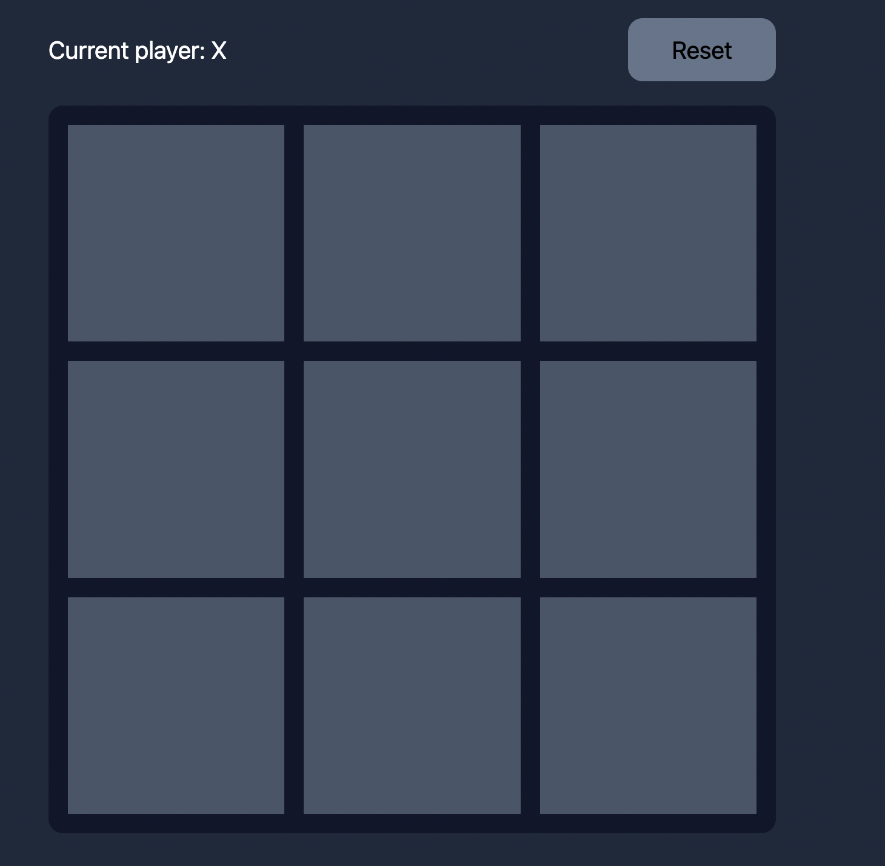

# Getting started

- This repository uses pnpm (follow the instructions here https://pnpm.io/installation)
- Run `pnpm` in your terminal to install all the dependencies
- Run `pnpm dev` in your terminal to start your dev server

# Task

Create a TicTacToe app like this:



## Requirements

You **must** follow this implementation:

```jsx
export default function Home() {
  const handleChange = (boardState, currentPlayer) => {
    // check if there are other moves available
    // fetch api to check if there is a winner
    // if winner open modal to show who is the winner
    // if no winner but moves available keep going
    // if no winner and no move is available show modal
  };

  return (
    <>
      <main>
        <Gameboard onChange={handleChange}>
          {(i) => <BoardBlock index={i} />}
        </Gameboard>
      </main>
    </>
  );
}
```

- No other props are allowed on the Gameboard and BoardBlock components. (Tip: You can use context internally)

- Setup a get-winner endpoint in the api folder to check if someone won or it's a draw.

- Fetch results from the endpoint on every change (Bonus points if you manage to use react query mutations)

- Bonus points if you manage to do some tests

- Use Tailwind

- Use Typescript
